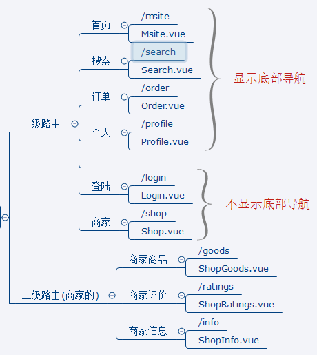
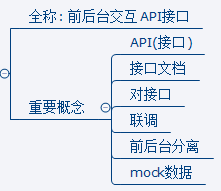
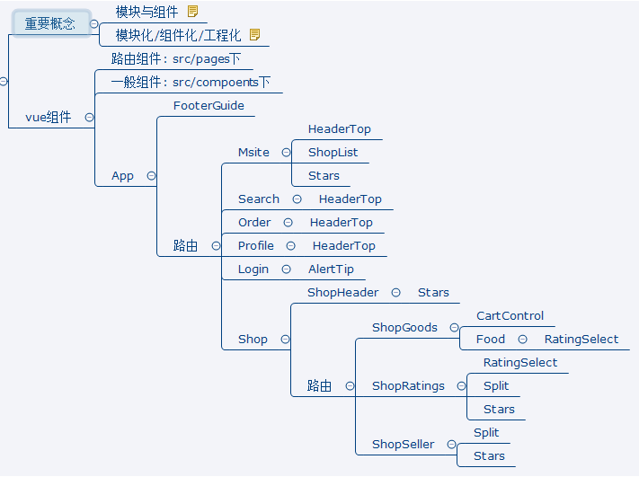

# take_out
> 尚硅谷外卖

## 1.项目准备

### 1.1项目描述

1. 使用vue全家桶+ES6+webpack等前端技术
2. 采用模块化、组件化、工程化的模式开发

### 1.2技术选型

1. 前台数据处理/交互/组件化:vue、vue-router、vuex、mint-ui、vue-lazyload、vue-scroller、better-scroll、swiper、moment、date-fns
2. 前后交互
	1. mock数据：mockjs
	2. 接口测试：postman
	3. ajax请求：vue-resource/axios
3. 模块化：ES6、babel
4. 项目构件/工程化：webpack、vue-cli、eslint
5. css预编译器：stylus

### 1.3前端路由



### 1.4API接口



### 1.5vue组件



## 2.开发详解

### 2.1项目开启

> 使用vue-cli(脚手架)搭建项目
```
npm install -g vue-cli        //下载vue-cli
vue init webpack take_out    //创建项目，使用webpack打包
cd take_out
npm run dev                    //运行该项目访问localhost：8080
```


